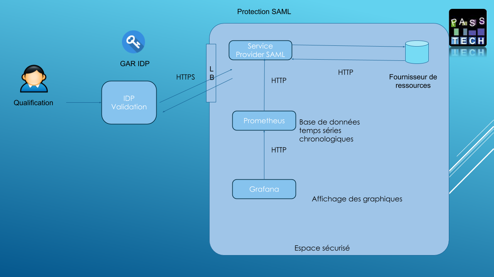

Ce scénario permet de tester un déploiement d'une protection de ressources avec la protocole SAML

4 containers sont déployés pendant ce scénario :
   - container pour la protection SAML,
   - container avec un site Web avec une ressource en PHP à protéger,
   - container pour la supervision avec Prometheus et Grafana,

